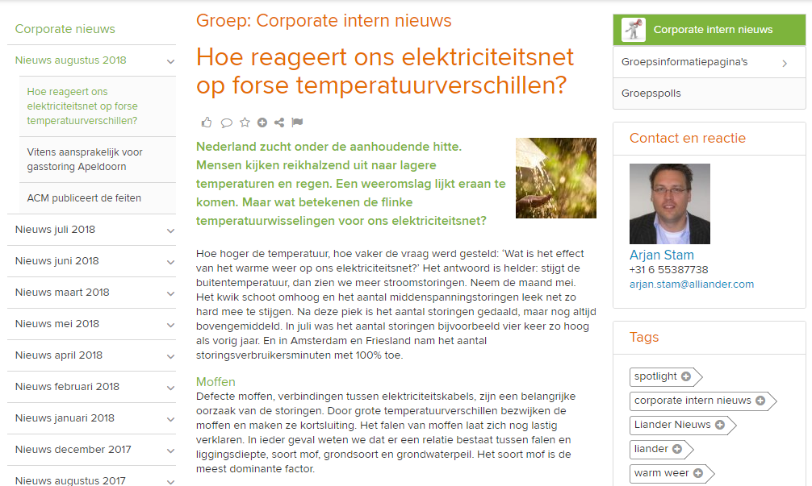

# InHouseRU2023
Repo Containing 'Failing CableConnections'

Let's try to predict which cable connections ('Moffen') are most likely to fail. This can be used to perform *preventive maintainance*.

Related repositories:
https://github.com/Alliander/rnd-ai-workshop
https://github.com/Alliander/AI-workshop
